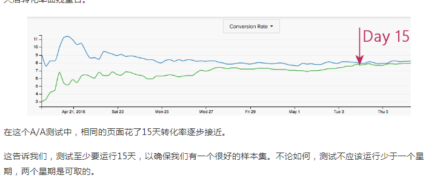

AA测试
===

Index
---
- [功能](#功能)
- [Reference](#Reference)

## 功能
- 检验AB测试工具的有效性
  - AA实验业务指标上**存在统计显著**，则工具有问题
  - AA实验**不存在统计显著**，则工具没问题
- 确定AB测试实验周期：即AA测试由**存在统计显著到不存在统计显著**

## Reference
- [增长黑客进阶之路：关于A/A测试，看这篇文章就够了
](http://www.woshipm.com/data-analysis/427086.html)
- [如何使用A/A测试，让数据更准确？](http://www.woshipm.com/data-analysis/438269.html) 
