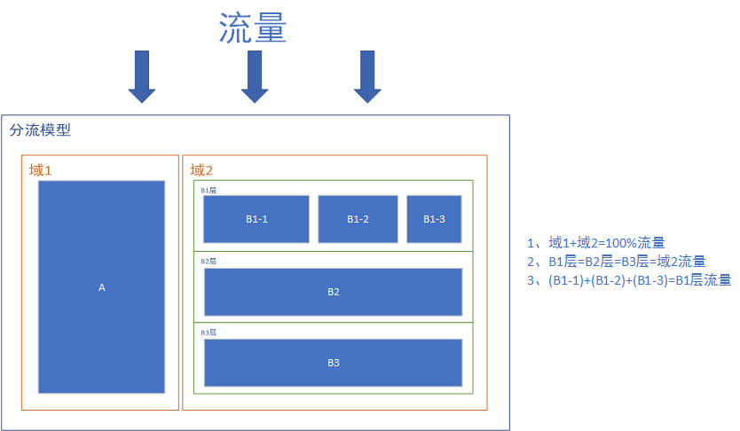
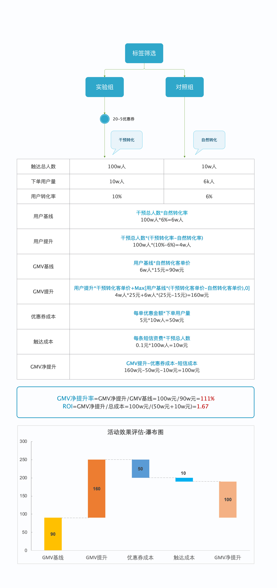
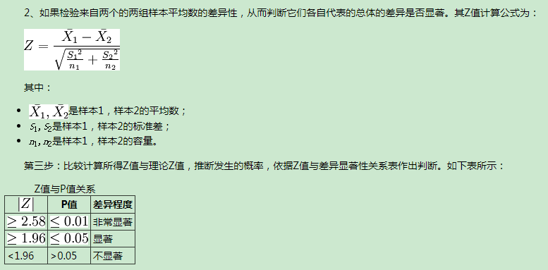
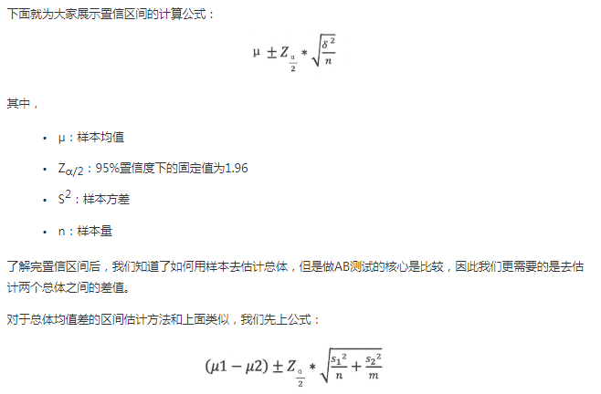
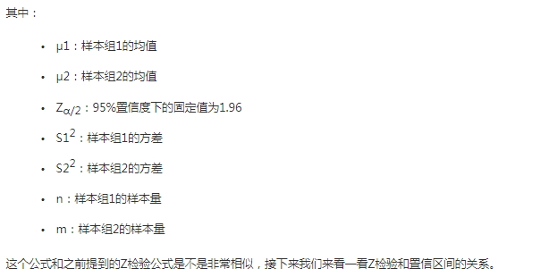

AB测试
===
Index
---
- [AB测试分流机制](#AB测试分流机制)
- [业务评估案例](#业务评估案例)
- [AB测试结果可靠性检验(Z检验)](#AB测试结果可靠性检验(Z检验))
- [Reference](#Reference)

## AB测试分流机制
- 定义 
A / B测试（桶测试或分流测试）是一个**随机实验**，通常有**两个变体，A和B**。利用**控制变量法保持有单一变量**的前提下，将A、B数据进行对比，得出实验结论
- AB实验模板
  - 域
  - 层
  - 流
- 分层、分流规则 
 
  - 规则详述 
分流(分域)遵循[互斥实验](./AB测试.md)：如域1和域2是互斥的，B1-1，B1-2，B1-3之间又是互斥的 
分层遵循[正交实验](./AB测试.md)：如B1层、B2层、B3层的流量是正交的 
分域的目的：不受其他任何实验的干扰 
  - 注意点 
不同层遵循**无任何的业务关联度规则** 
- 两种实验
  - 正交实验：每个独立实验为一层，层与层之间流量是正交的，一份流量**穿越**每层实验时，都会**再次随机打散**
  - 互斥实验：实验在同一层拆分流量，且不论如何拆分，不同组的流量是**不重叠(互斥)**的
## 业务评估案例

## AB测试结果可靠性检验
- 模板 
 
  - 原假设：实验组均值与对照组均值相等
  - 构造Z统计量：因为样本均值的抽样分布服从**正态分布**（均值p, 方差pq,因为总体服从**伯努利分布**） -> 构造的Z统计量符合正态分布，所以可以和标准正态分布理论值进行比较 
  - 比较Z值和理论值，确定是否显著
- 陷阱
  - n1,n2非常大陷阱：Z检验的结果**容易显著（敏感区）**，因为分母会趋向0
  - n1,n2非常小陷阱：Z检验的结果**很难显著（不敏感区）**，因为分母会趋向一个很大的值
- (X%)置信区间 
 
 
  - (X%)置信区间定义 
  总体参数有X%的概率落在置信区间内，置信区间的直观理解是**均值上下波动的一个区间**
  - 模板 
  [均值 - 分布理论值 x 标准差, 均值 + 分布理论值 x 标准差] 
  如上图中的正态分布的95%置信区间
  

## Reference
- [一文搞懂AB Testing的分层分流](http://www.woshipm.com/pd/1080730.html)
- [复盘：如何从0~1搭建AB Test系统](http://www.woshipm.com/pd/2425383.html)
- [增长策略：如何用AB测试进行活动评估及优化？](http://www.woshipm.com/pd/2078040.html)
- [你的A/B测试结果真的靠谱吗？](http://www.woshipm.com/data-analysis/2207880.html)
- [你的A/B测试结果有多靠谱？](http://www.woshipm.com/data-analysis/2207880.html)
- [样本均值的抽样分布](https://baike.baidu.com/item/%E6%A0%B7%E6%9C%AC%E5%9D%87%E5%80%BC%E7%9A%84%E6%8A%BD%E6%A0%B7%E5%88%86%E5%B8%83/7181356?fr=aladdin)
