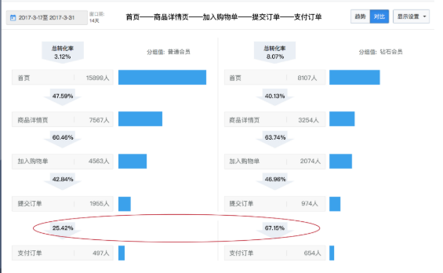

漏斗分析模型
===

Index
---
- [定义](#定义)
- [模板](#模板)
- [分析视角](#分析视角)
- [注意点](#注意点)
- [Reference](#Reference)

## 定义
漏斗分析是一套**流程式数据分析**，它能够科学反映用户行为状态以及**从起点到终点各阶段用户转化率情况**的重要分析模型 
如**直播用户从激活APP开始到花费**，一般的用户购物路径为激活APP、注册账号、进入直播间、互动行为、礼物花费五大阶段，漏斗能够展现出**各个阶段的转化率**，通过漏斗各环节相关数据的比较,能够直观地发现和说明问题所在，从而**找到优化方向**。

## 模板
- 开始  数量  转换率
- 阶段A N_A  CVR_A 
- 阶段B N_B  CVR_B
- 阶段C N_C  CVR_C
- ...  ...  ...
- 结束  N_end    CVR_end 

## 分析视角
原作者把它叫做“漏斗分析模型的特点与价值”，但我觉的“分析视角”更合适，核心是在漏斗分析模型框架下，寻找优化点的视角 
- 纵向视角（原型视角），即观察从开始-A-B-C的转化情况
- 时间视角，即切面时间去看各个阶段的趋势
- 用户对比视角，即将用户分层（如新老、渠道来源等），对比分析不同用户的漏斗

## 注意点
做好科学归因，科学关联，使得模型分析更科学
- 归因:用户转化应科学归因到直接导致用户转化的事件
- 属性关联：用户转化分子、分母的统计口径保持一致

## Reference
- [常见用户行为分析模型解析（3）——漏斗分析模型](http://www.woshipm.com/data-analysis/697156.html)

