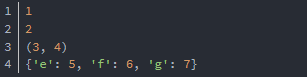

# python代码技巧
## [参数](./python.md)
 - 一个\*号代表将**多个**参数转换为一个**对象**：tuple类型，可以进行tuple操作
 - 两个\*号代表将**多个**参数转换为一个**对象**：dict类型，可以进行dict操作
 - 1和2同时出现时最好用**key-value**形式说明放入dict对象的参数，如
 ```
 def foo(a, b=10, *args, **kwargs):
    print (a)
    print (b)
    print (args)
    print (kwargs)
foo(1, 2, 3, 4, e=5, f=6, g=7)
 ```
 
## [debug](./python.md)
 - **debug是很好的源码阅读助手，通过设置断点可以更快的了解代码的功能**
 - 花10分钟阅读、实践下[Pycharm中debug](https://www.ibm.com/developerworks/cn/linux/l-cn-pythondebugger/index.html)
## [yield](./python.md)

 
