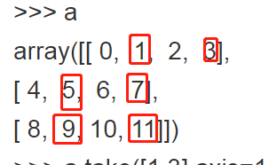
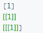

# python技巧
## [参数](./python.md)
 - 一个\*号代表将**多个**参数转换为一个**对象**：tuple类型，可以进行tuple操作
 - 两个\*号代表将**多个**参数转换为一个**对象**：dict类型，可以进行dict操作
 - 1和2同时出现时最好用**key-value**形式说明放入dict对象的参数，如
 ```
 def foo(a, b=10, *args, **kwargs):
    print (a)
    print (b)
    print (args)
    print (kwargs)
foo(1, 2, 3, 4, e=5, f=6, g=7)
 ```
 
## [debug](./python.md)
 - **debug是很好的源码阅读助手，通过设置断点可以更快的了解代码的功能**
 - 花10分钟阅读、实践下[Pycharm中debug](https://www.ibm.com/developerworks/cn/linux/l-cn-pythondebugger/index.html)
## [生成器](./python.md)
 - 由关键字**yeild**标识，生成的是**迭代器**,只在**next类函数**（如next(),for ... in ....,前者只生成一个元素）中才生成迭代器中的元素
 - 一个比较好的理解是，可以把它看做是**return**
 - 注意它会导致程序产生“断点”，如果yeild 后面是赋值语句，[**注意赋值是在“断点”后才赋值的**](https://blog.csdn.net/qq_36330643/article/details/78247070)
 - 最大的好处就是**避免内存浪费**，如读文件的时候，如果文件很大，通常会内存溢出，但是yeild可以优雅的解决
 ```
 def read_file(fpath): 
   BLOCK_SIZE = 1024 ## 分成固定大小的小文件进行读取
   with open(fpath, 'rb') as f: ## with open ... as ,自动采用缓冲IO和内存管理
       while True: 
           block = f.read(BLOCK_SIZE)  ## 读取固定大小的数据块
           if block: 
               yield block ## yeild关键字可以理解为retrun, yeild后就释放内存了 
           else: 
               return ## 返回的read_line是一个迭代器，每个元素是yeild关键字标识的数据块
 ```
## [permutation](./python.md)
 - 最常用的是生成一个**打乱的index的副本**，可以理解和**shuffle**功能一致，但是不改变原index
 - 功能如其名字，**排列**：一组数的可能的排列
 - 代码如下：
 ```
 import numpy as np
 print(np.random.permutation(10))
 ```
 
 ## [ndarray中take方法](./python.md)
 - 根据index、axis获取数组中的元素:**ndarray.take(indices,axis)**
 - 代码如下：
 ```
 imort numpy as np
 a = np.arange(12).reshape(3,4)
 a.take(indices=[1,3],axis=1) # 获取1,3列的数据
 ```
 
 ## [six库](./python.md)
 - **兼容**Python2与Python3
 ## [numpy中atleast_xd,np.array,array.astype](./python.md)
 - atleast_xd,x可以是1，2,3,用来**转换数组维数**：
 ```
 import numpy as np
 np.atleast_1d([1])
 np.atleast_2d([1])
 np.atleast_3d([1])
 ```
 
- np.array, 用来设置array的属性，主要是**转换数据类型，即修改dtype**
```
array = np.array(array,dtype=dtype,order=order,copy=copy)
```
- array.astype, 用来**转换数据类型,即修改dtype**
```
array.astype(np.float64)
```
- dtype 与 astype 的**区别**：
'dtype' can only be used to 'upcast' the array.  For downcasting, use the .astype(t) method.
## [异常处理](./python.md)
- 异常处理模板
```
try：
    检验语句-自动抛出异常or手动抛出异常raise/assert
except ValueError as e: #捕获异常处理模板
    处理异常语句，一般是print(e)
except Exception as ex: #捕获所有异常，因为抛出的异常不捕获处理，会导致程序崩溃
    print(ex)
else:
    校验通过时执行，反之不执行
finally:
    无论是否通过校验，均执行    
```
- 花5分钟实践下,[手动抛异常raise](https://www.jianshu.com/p/de25635ef4f5),[手动抛异常assert](https://blog.csdn.net/shijichao2/article/details/61421735?utm_source=blogxgwz6)
  - raise
  - assert：常用在**参数检查**
 ```
 # raise example
 try：
     raise ZeroDivisionError #这里的异常也可以是自定义的异常
 except ZeroDivisioError as e：
     print(e)
 else:
     pass
 finally:
     pass
 ```
  
```
# assert example
try:
    assert expression1, expression2
except AssertionError as e:
    print(e)
else:
    pass
finally:
    pass
```
- 花5分钟实践下，[自定义异常](https://www.runoob.com/python3/python3-errors-execptions.html)
```
class myError(Exception):
    def __init__(self, value):
        self.value = value
    def __str__(self):
        return repr(self.value)
```
