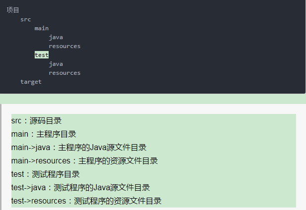
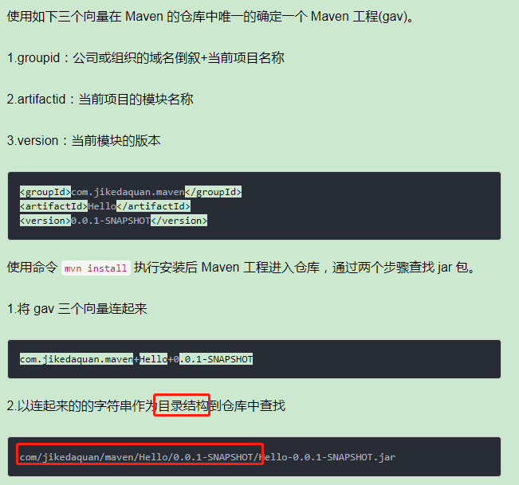
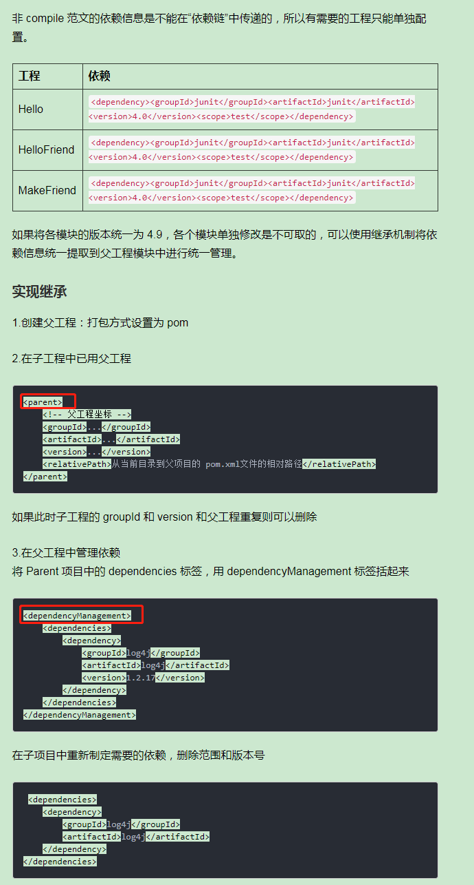
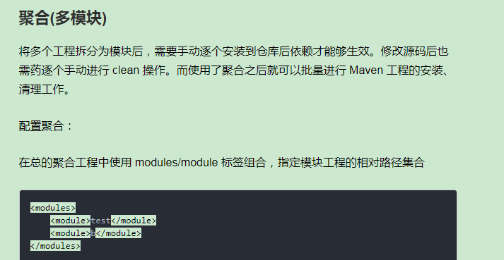

Maven
===

Index
---
- [定位](#定位)
- [构建过程](#构建过程)
- [核心概念](#核心概念)
- [Reference](#Reference)

## 定位
Apache下一款自动构建工具，专注用**本地仓库中的插件**服务于**Java平台的项目构建和依赖管理**<br/>


## 构建过程
1.清理：删除以前的编译结果，为重新编译做好准备<br/>
2.编译：将 Java 源程序便以为字节码文件<br/>
3.测试：针对项目中的关键点进行测试，确保项目在迭代开发过程中关键点的正确性<br/>
4.报告：在每一次测试后以标准的格式记录和展示测试结果<br/>
5.打包：将一个包含诸多文件的工程封装为一个压缩文件用于安装或部署。Java 工程对应 jar 包，Web 工程对应 war 包<br/>
6.安装：在 Maven 环境下特指将打包的结果—— jar 包或 war 包安装到本地仓库<br/>
7.部署：将打包的结果部署到远程仓库或将 war 包部署到服务器上运行<br/>

## 核心概念
- 约定的目录结构<br/>
Maven实现自动化构建的必不可缺的一环，保证maven找到java源文件，编译后的字节码也有一个存储位置<br/>

- POM：Project Object Model<br/>
Maven中工作的基本单位，一个xml文件,**学习maven就是学习pom.xml文件中的配置**<br/>
将java工程的相关信息封装为**对象**，便于操作和管理<br/>

- Maven坐标<br/>
**Maven坐标，即定位目录**<br/>

- 依赖管理<br/>
  - 实现依赖<br/>
  **模板**<br/>
  ```
  <dependency>
    <groupId>com.jikedaquan.maven</groupId>
    <artifactId>Hello</artifactId>
    <version>0.0.1-SNAPSHOT</version>
    <scope>compile</scope> ## 依赖范围：compile(编译)，test(测试)，provided(部署)
  </dependency>
  ```
  - 依赖排除<br/>
  **排除**
  ```
  <dependencies>
    <dependency>
        <groupId>com.jikedaquan</groupId>
        <artifactId>c</artifactId>
        <version>1.0-SNAPSHOT</version>
        <exclusions> ## exclusions就是排除部分内容
            <exclusion>
                <groupId>mysql</groupId>
                <artifactId>mysql-connector-java</artifactId>
            </exclusion>
        </exclusions>
    </dependency>
  </dependencies>
  ```
  - 版本号同一声明<br/>
  **模板**<br/>
  ```
  <properties>
    <mysql-connector.version>5.1.47</mysql-connector.version>
  </properties>
  <dependency>
    <groupId>mysql</groupId>
    <artifactId>mysql-connector-java</artifactId>
    <version>${mysql-connector.version}</version>
  </dependency>
  ```
- 仓库管理<br/>
仓库：本地仓库、远程仓库<br/>
仓库中存储的文件: Maven插件，自己开发的项目模块，第三方框架或工具的jar包
- 生命周期<br/>
声明周期定义了各个环节的执行顺序<br/>
**3套独立的声明周期**<br/>
1.clean:构建前的清理<br/>
2.default：构建的核心<br/>
3.site：生成项目报告<br/>
- 插件和目标<br/>
maven只定义抽象的声明周期,具体任务交给插件完成<br/>
每个插件都能实现多个功能，**每个功能就是一个插件目标**<br/>
**maven 的生命周期与插件目标相互绑定，以完成某个具体的构建任务**
- 依赖继承<br/>
避免重复的配置<br/>

- 聚合<br/>
方便统一构建<br/>


## Reference
- [Maven 常见知识点整理](https://www.jianshu.com/p/2ffad8918b09)
- [Maven知识点总结](https://cloud.tencent.com/developer/article/1401694)
- [Maven 教程](https://www.runoob.com/maven/maven-tutorial.html)
