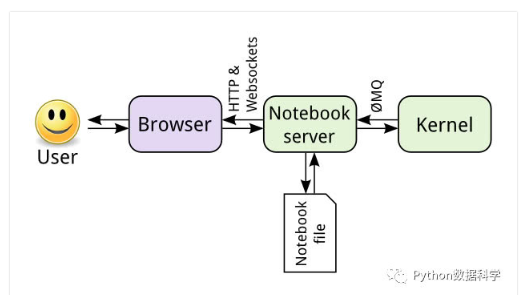

jupyter
===

Index
---
- [定位](#定位)
- [语法支持](#语法支持)
- [架构](#架构)
- [模板](#模板)
- [快捷键](#快捷键)
- [magic关键字python](#magic关键字python)
- [生成目录](#生成目录)
- [进阶版工具jupyterlab](#进阶版工具jupyterlab)
- [Reference](#Reference)

## 定位
交互式笔记本,可将代码、文字、图表完美结合起来，输出分析报告<br/>
创建和共享程序文档的web应用程序

## 语法支持
- markdown
- latex公式
- html/R/Python等40多种编程语言<br/>

## 架构



## 安装方式
- 本地部署
  - pip
  - anaconda
- [远程部署](https://blog.csdn.net/weixin_41079550/article/details/89199254)
 
## 模板
- numpy：矩阵运算，N维数组对象ndarray
  - 数组属性<br/>
  维度的数量：ndarray.ndim<br/>
  数组的维度：ndarray.shape<br/>
  数组元素的大小：ndarray.size
  - 创建数组
  ```
  numpy.array(shape, dtype = float, order = 'C')
  np.asarray() # 从已有数组创建数组
  np.zeros()
  np.ones()
  np.empty()
  np.arrange() # 生成等差数列
  np.linspace() # 生成等差数列
  np.frombuffer() # 从数据流中生成
  np.fromiter() # 从迭代对象中生成
  np.reshape()  # 对数组的形状重构
  ```
  - 索引
  ```
  A[2] # 整数索引
  A[2,1:3] # 数组索引
  A[~np.isnan(A)] # 布尔索引
  ```
- pandas：numpy的升级版本
- sklearn：

## 快捷键


## magic关键字python
- 功能
控制notebook本身或执行系统调用
- 关键字分类
  - 行magic命令（一个百分号%）：仅应用于编写magic命令时所在的行
  - 单元格magic命令（两个百分号%%）：应用与整个单元格
- 常用magic关键字
  - 代码计时：%timeit/%%timeit
  - 在notebook中嵌入可视化内容:%matplotlib inline
  - 在notebook中调试代码：%pdb
  - 运行.py文件：%run filename.py
  

## 生成目录
<br/>


## [进阶版工具jupyterlab](https://www.jianshu.com/p/90982d195160)

## Reference
- [jupyter部署指南](https://blog.csdn.net/weixin_41079550/article/details/89199254)
- [只需15分钟，使用谷歌云平台运行Jupyter Notebook](https://blog.csdn.net/Uwr44UOuQcNsUQb60zk2/article/details/78610044)
- [google云平台的使用](https://blog.csdn.net/golduty2/article/details/82151407)
- [Jupyter notebook快速入门教程](https://cloud.tencent.com/developer/news/208412)
- [Jupyter Notebook Quickstart](https://jupyter.readthedocs.io/en/latest/content-quickstart.html)
- [magic关键字](https://www.jianshu.com/p/97fd13a71d93)
- [jupyter notebook导出包含中文的PDF并正常显示pandas表格](https://www.jianshu.com/p/e97946777866)
- [python数据分析及处理案例技巧11-20（基于jupyter）](https://blog.csdn.net/pbgc396dwxjb77f2je/article/details/78786978)
- [python数据分析及处理案例技巧1-10（基于jupyter）](https://blog.csdn.net/PbGc396Dwxjb77F2je/article/details/78786979)
- [Jupyter Notebook 添加目录插件](https://www.jianshu.com/p/7687c6bec65e)

