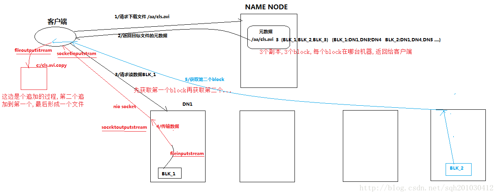
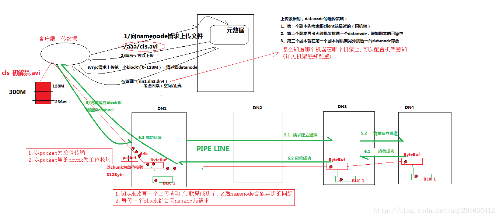

Hadoop生态圈之HDFS
===

Index
---
- [定位](#定位)
- [HDFS架构](#HDFS架构)
- [HDFS优缺点](#HDFS优缺点)
- [HDFS存储数据](#HDFS存储数据)
- [HDFS读取下载文件](#HDFS读取下载文件)
- [HDFS写入上传文件](#HDFS写入上传文件)
- [HDFS副本存放策略](#HDFS副本存放策略)
- [HDFS2新特性](#HDFS2新特性)
- [linux下HDFS的简单操作](#linux下HDFS的简单操作)
- [测试](#测试)
- [Reference](#Reference)

## 定位
分布式文件存储系统,是分布式计算中数据存储管理的基础<br/>
在一个大集群中，可以**跨机器的可靠的**存储海量文件,将每个文件存储成block序列<br/>


## HDFS架构
HDFS采用**Master/Slave**架构来存储数据


## HDFS优缺点
- 优点<br/>
**高容错性**，因为自动保存多个副本<br/>
适合**批处理**， 因为移动计算而不是移动数据，将数据位置暴露给计算框架<br/>
适合**大数据处理**，因为能处理GB、TB、甚至PB的数据<br/>
**流式文件访问**，因为一次写入，多次读取，文件一旦写入不能修改，只能追加<br/>
**可构建在廉价机器上**<br/>
- 缺点<br/>
不能做到**低延迟数据访问**，因为适合高吞吐率的场景,[改进策略](https://blog.csdn.net/wl1411956542/article/details/52817601)<br/>
不适合**小文件存储**，因为①会占用Namenode大量内存来存储文件、目录和块信息，而内存有限；②小文件存储的寻道时间超过读取时间，违背HDFS设计目标,[改进策略](https://blog.csdn.net/wl1411956542/article/details/52817601)<br/>
不能**并发写入，随机修改**，因为①一个文件不允许多个线程同时写；②仅支持数据追加，不支持文件随机修改<br/>

## HDFS存储数据

- client,客户端<br/>
**文件切分成block,上传到HDFS**<br/>
管理/访问HDFS<br/>
与namenode交互，获取文件位置信息<br/>
与datanode交互，读取或者写入数据<br/>
- namenode，即master<br/>
管理HDFS命名空间<br/>
管理block映射信息<br/>
配置副本策略<br/>
处理客户端读写需求<br/>
- datanode，即slave<br/>
执行实际数据block的**存储、读写操作**<br/>
- secondary namenode，不是namenode的热备份<br/>
辅助namenode,**定期合并fsimage/fsedits**, 并推送给namenode<br/>
紧急情况下，**恢复namenode**<br/>

## HDFS读取下载文件
client 请求 nn 获取文件 block 列表 -> <br/>从 dn 中获取列表中每个 block 的数据 -> <br/>重复步骤2 -> <br/>合并 block,形成文件 -> <br/>关闭读操作


## HDFS写入上传文件
client 切分文件为数据block序列 -> <br/>请求nn为block序列中每个block分配dn -> <br/>client以packet为单位向dn pipeline写入数据 -> <br/>ack -> <br/>重复2-4 -> <br/>close写操作


## HDFS副本存放策略


## HDFS2新特性
引入namenode federation,解决了横向内存扩展<br/>
引入namenode ha，解决了namenode单点故障<br/>
<br/>
引入了yarn,负责资源管理和调度<br/>
引入了resourcemanager ha，解决了resourcemanager 单点故障<br/>


## linux下HDFS的简单操作
- 模板<br/>
```
对hdfs的操作方式：hadoop fs xxx
  hadoop fs -ls  /  查看hdfs的根目录下的内容的
  hadoop fs -lsr /  递归查看hdfs的根目录下的内容的
  hadoop fs -mkdir /d1  在hdfs上创建文件夹d1
  hadoop fs -put <linux source> <hdfs destination> 把数据从linux上传到hdfs的特定路径中
  hadoop fs -get <hdfs source> <linux destination> 把数据从hdfs下载到linux的特定路径下
  hadoop fs -text <hdfs文件>  查看hdfs中的文件
  hadoop fs -rm     删除hdfs中文件
  hadoop fs -rmr    删除hdfs中的文件夹
```

## [测试](../测试/HDFS测试)

## Reference
- [技术分享丨HDFS 入门](https://zhuanlan.zhihu.com/p/21249592)
- [Hadoop基本知识点之HDFS](https://www.jianshu.com/p/0f6b0088e2f3)
- [Hadoop之HDFS核心知识点](https://www.icode9.com/content-4-306.html#%E4%B8%BA%E4%BB%80%E4%B9%88%E9%80%89%E6%8B%A9HDFS%E5%AD%98%E5%82%A8%E6%95%B0%E6%8D%AE)
- [hadoop核心知识点总结](https://blog.csdn.net/wl1411956542/article/details/52817601)
- [hadoop-HDFS的简单操作](https://www.jianshu.com/p/e3754bda123c)
- [唯品会 HDFS 性能挑战和优化实践](https://www.infoq.cn/article/7o96tvJwNelq4xp-7Puh)
