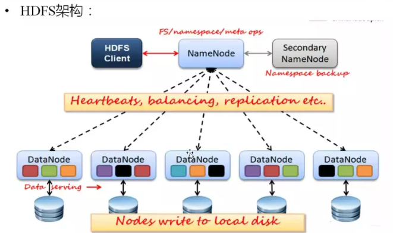
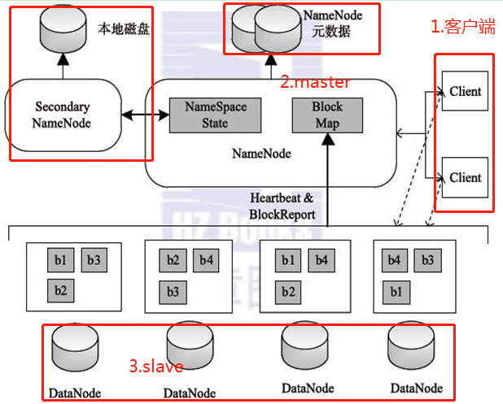
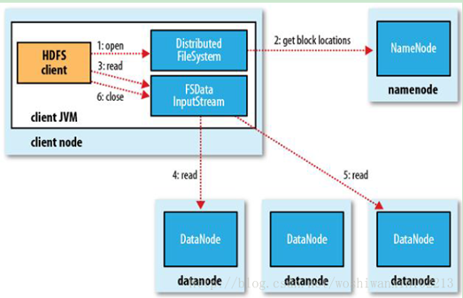
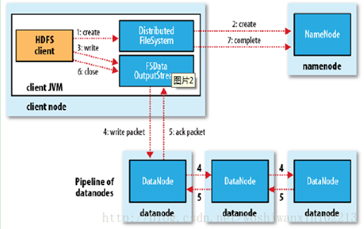
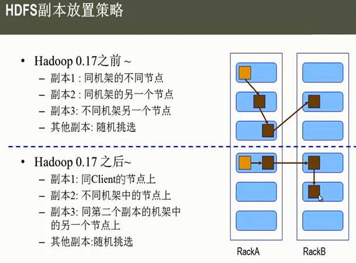
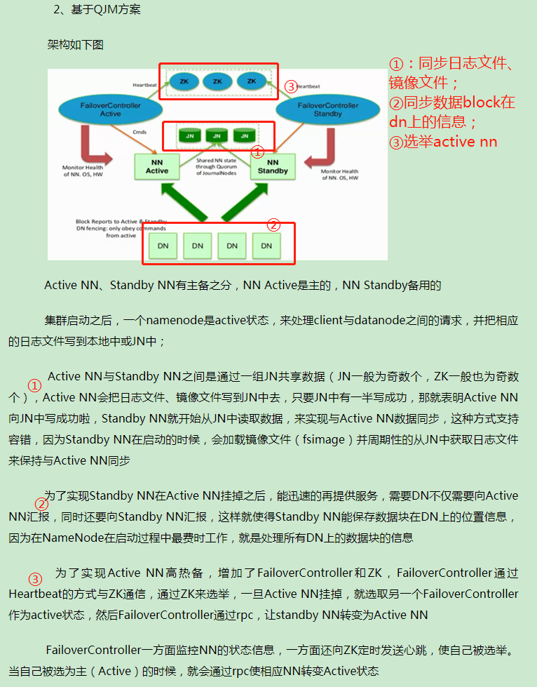
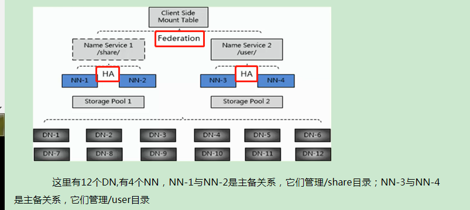

Hadoop生态圈之HDFS
===

Index
---
- [定位](#定位)
- [HDFS架构](#HDFS架构)
- [HDFS优缺点](#HDFS优缺点)
- [HDFS存储数据](#HDFS存储数据)
- [HDFS读取文件](#HDFS读取文件)
- [HDFS写入文件](#HDFS写入文件)
- [HDFS副本存放策略](#HDFS副本存放策略)
- [HDFS2新特性](#HDFS2新特性)
- [Reference](#Reference)

## 定位
分布式文件存储系统,是分布式计算中数据存储管理的基础 
可运行在廉价的善用服务器上

## HDFS架构
HDFS采用**Master/Slave**架构来存储数据

## HDFS优缺点
- 优点 
**高容错性**，因为自动保存多个副本 
适合**批处理**， 因为移动计算而不是移动数据，将数据位置暴露给计算框架 
适合**大数据处理**，因为能处理GB、TB、甚至PB的数据 
**流式文件访问**，因为一次写入，多次读取，文件一旦写入不能修改，只能追加 
**可构建在廉价机器上** 
- 缺点 
不能做到**低延迟数据访问**，因为适合高吞吐率的场景 
不适合**小文件存储**，因为①会占用Namenode大量内存来存储文件、目录和块信息，而内存有限；②小文件存储的寻道时间超过读取时间，违背HDFS设计目标 
不能**并发写入，随机修改**，因为①一个文件不允许多个线程同时写；②仅支持数据追加，不支持文件随机修改 

## HDFS存储数据

- client,客户端 
**文件切分成block,上传到HDFS** 
管理/访问HDFS 
与namenode交互，获取文件位置信息 
与datanode交互，读取或者写入数据 
- namenode，即master 
管理HDFS命名空间 
管理block映射信息 
配置副本策略 
处理客户端读写需求 
- datanode，即slave 
执行实际数据block的**存储、读写操作** 
- secondary namenode，不是namenode的热备份 
辅助namenode,**定期合并fsimage/fsedits**, 并推送给namenode 
紧急情况下，**恢复namenode** 

## HDFS读取文件

## HDFS写入文件

## HDFS副本存放策略

## HDFS2新特性
引入namenode federation,解决了横向内存扩展 
引入namenode ha，解决了namenode单点故障 
 
引入了yarn,负责资源管理和调度 
引入了resourcemanager ha，解决了resourcemanager 单点故障 

## Reference
- [技术分享丨HDFS 入门](https://zhuanlan.zhihu.com/p/21249592)
- [Hadoop基本知识点之HDFS](https://www.jianshu.com/p/0f6b0088e2f3)
- [Hadoop之HDFS核心知识点](https://www.icode9.com/content-4-306.html#%E4%B8%BA%E4%BB%80%E4%B9%88%E9%80%89%E6%8B%A9HDFS%E5%AD%98%E5%82%A8%E6%95%B0%E6%8D%AE)
- [hadoop核心知识点总结](https://blog.csdn.net/wl1411956542/article/details/52817601)
