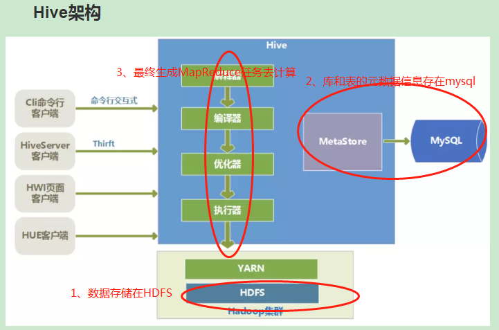
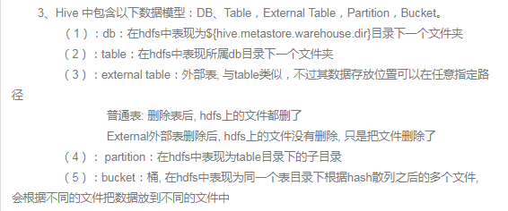

Hadoop生态圈之Hive
===

Index
---
- [定位](#定位)
- [架构](#架构)
- [重要概念](#重要概念)
- [Hive文件格式](#Hive文件格式)
- [Hive的rowformat](#Hive row format)
- [Hive写入数据的方式](#Hive 写入数据的方式)
- [Reference](#Reference)

## 定位
基于Hadoop的一个**数据仓库工具**，可以用来进行数据提取转化加载ETL<br/>
将(1)HDFS上结构化的数据文件映射为一张数据表，(2)写sql语句实现查询，(3)后台将sql语句转换成MapReduce任务运行<br>

## 架构


- 底层存储<br/>
Hive数据是存储在HDFS上的，Hive中的库表可以看做是HDFS上数据做的一个**映射**


- 语句执行过程<br/>
Hive生成**MapReduce程序**，执行器将程序放到YARN上以一系列Job的方式去执行

- 元数据存储<br/>
Hive的元数据存储在**MYSQL这种关系型数据库**上

## 重要概念
- 外部表与内部表
  - 外部表(external table)<br/>
  导入文件时**不移动文件**，仅仅添加metadata，外部表指向的数据发生变化会自动更新<br/>
  删除外部表时，原数据不会被删除<br/>
  创建语句<br/>
  ```
  create external table xxx
  ```
  - 内部表(managed table)，默认创建的是内部表<br/>
  导入文件时，是**将文件移动到指定位置，即原有路径下文件不在存在**<br/>
  删除表的时候，**数据和元数据都将被删除**<br/>
  创建语句<br/>
  ```
  create table xxx
  ```
  
  - 区别外部表与内部表<br/>
  ```
  describe formatted table_name
  ```
  
- 分区表和桶表
  - 分区(partitioned)<br/>
  一个Hive表在HDFS上有一个对应的目录来存储数据<br/>
  普通表的数据直接存储在改目录下<br/>
  **分区表按分区键划分子目录来存储**<br/>
  创建语句<br/>
  ```
  partitioned by xxx
  ```
  - 分桶(clustered)<br/>
  分桶是对分区进行更细粒度的划分,**一个桶里的数据存放在一个文件中**<br/>
  分桶方式：将数据**按照某列属性值的hash值，对桶的个数取模**，对数据进行分桶<br/>
  创建语句<br/>
  ```
  clustered by user_id sorted by leads_id into 10 buckets
  ## clustered by user_id:按照cluster_id分桶
  ## sorted by leads_id:桶内数据按leads_id排序，join操作时获得很高的效率
  ## into 10 bucktes:分成10个桶
  ```
  - 分区与分桶的目的<br/>
  提高查询效率，即查询时**不用遍历全部目录（分区）、全部桶（分桶）**

## Hive文件格式
- 文件存储格式<br/>
textfile,**默认格式**<br/>
sequencefile<br/>
rcfile<br/>
orcfile<br/>
- [行存储与列存储](./存储.md)
  - 行存储
    - 优点<br/>
    相关数据保存在一起，符合**面向对象**的思维，因为一行数据就是一条记录<br/>
    方便update/insert操作
    - 缺点<br/>
    不能跳过不必要的列存取,数据量大的时候就影响性能<br/>
    不能获得较高的压缩比，因为每行中各列的数据类型不一致，所以空间利用率不高<br/>
    不是所有列都适合做索引<br/>
  - 列存储
    - 优点<br/>
    可以跳过不必要的列查询<br/>
    高效的压缩比,因为列数据类型一致<br/>
    任何列都可以做索引
    - 缺点<br/>
    insert/update很麻烦<br/>
    不适合扫描小量的数据<br/>
- textfile<br/>
默认格式，不做压缩，磁盘开销大
- sequencefile<br/>
二进制文件支持，可分割，可压缩<br/>
通常用block压缩
- rcfile<br/>
行列存储相结合的存储方式，数据按行分块，块数据列式存储<br/>
元祖重构代价低，因为数据按行分块<br/>
压缩比比较好，因为可以通过列进行压缩<br/>
可以跳过不必要的列，因为块内数据按列存储<br/>
- orcfile<br/>
optimized rcfile<br/>
支持更复杂的数据类型，如datetime,decimal,struct,list,map<br/>
基于数据类型的块模式压缩，如Integer类型使用RLE(RunLength Encoding)算法<br/>
使用单独的RecordReader并行读取文件<br/>
绑定读写所需的内存<br/>
元数据存储使用PB，允许添加和删除字段<br/>

## Hive row format
创建hive表时用row format 参数说明**SerDe**(Serializer/Deserializer的简写，hive使用Serde进行行对象的序列与反序列化)的类型<br/>
语句:<br/>
```
CREATE [EXTERNAL] TABLE [IF NOT EXISTS] table_name
[(col_name data_type [COMMENT col_comment], ...)]  ## 字段声明子句
[COMMENT table_comment]  ## 表描述子句
[PARTITIONED BY (col_name data_type [COMMENT col_comment], ...)] ## 创建分区子句
[CLUSTERED BY (col_name, col_name, ...)  ## 创建分桶子句
[SORTED BY (col_name [ASC|DESC], ...)]
INTO num_buckets BUCKETS]
[ROW FORMAT row_format]  ## 设置对象序列化反序列化类型子句
[STORED AS file_format]  ## 设置文件格式子句
[LOCATION hdfs_path]  ## 设置文件实际路径子句
```
默认SerDe<br/>
```
row format delimited
```

## Hive 写入数据的方式
- 从本地文件系统中导入数据到Hive表<br/>
```
load data local inpath 'xxx.txt' into table xxx;
```
- 从HDFS上导入数据到Hive表<br/>
```
load data inpath '/home/xxx/ddd.txt' into table xxx;
```
- 从别的表中查询出相应的数据并导入Hive表
  - 表已创建<br/>
  ```
  insert overwrite table xxx partition(dt='2018-09-26')
  select uid,model,key,value 
  from yyy where dt='2018-09-26';
  ```
  - 表未创建<br/>
  ```
  [drop table if exists tmp_train.tyh_test32dragonboatfestival_showrank_1;]
  create table [if not exists tmp_train.tyh_test32dragonboatfestival_showrank_1]
  [location '/data/train/tmp_train/tyh_test32dragonboatfestival_showrank_1'] as 
  select a,b,c
  from xxx
  where a>b;
  ```

## Reference
- [Hive基础入门](https://zhuanlan.zhihu.com/p/51210324)
- [一脸懵逼学习Hive的使用以及常用语法（Hive语法即Hql语法）](https://cloud.tencent.com/developer/article/1010869)
- [Hive介绍与核心知识点](https://www.jianshu.com/p/e9ec6e14fe52)
- [Hadoop：HDFS数据存储与切分](https://blog.csdn.net/oraclestudyroad/article/details/51991576)
- [Hive row format](https://www.cnblogs.com/rrttp/p/9024153.html)
