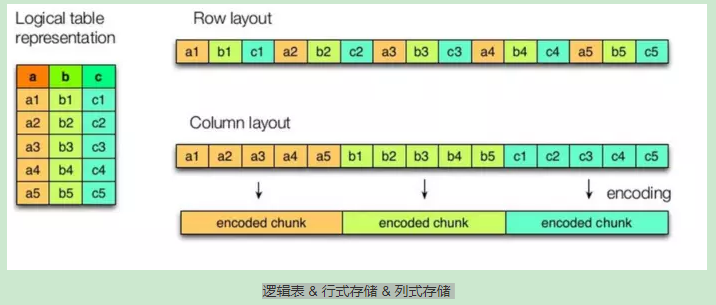
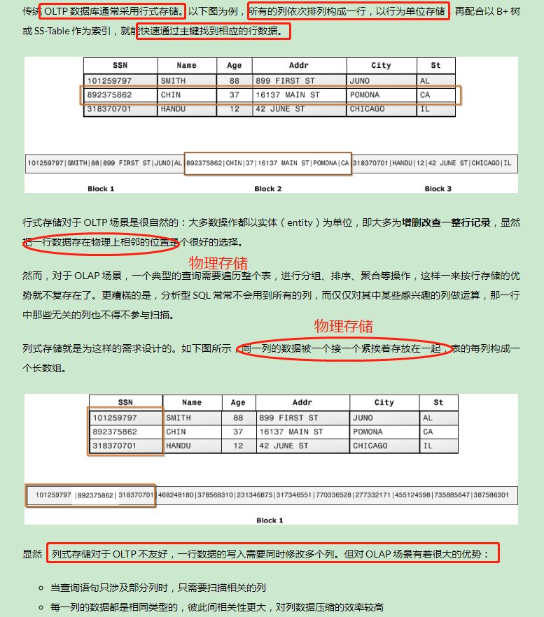

存储
===

Index
---
- [存储格式](#存储格式)
- [数据仓库的存储格式选择](#数据仓库的存储格式选择)
- [常用的存储格式与压缩格式](#常用的存储格式与压缩格式)
- [列式存储](#列式存储)
- [Reference](#Reference)

## 存储格式
- 存储方式 

- 行式存储与列式存储的应用场景 

## 数据仓库的存储格式选择
数据仓库一般都常用的存储格式与压缩格式是**一次写入，多次读取**，且经常**取少部分列并对其进行聚合操作**，所以比较适合列式存储
- OLTP(事务型数据库) 
行存储
- OLAP(分析型数据库) 
列存储

## 常用的存储格式与压缩格式
选择合适的存储格式和压缩格式的搭配，是为了**平衡（读写）时间与（存储）空间**

## 列式存储

## Reference
- [大数据存取的选择：行存储还是列存储？](https://www.infoq.cn/article/bigdata-store-choose)
- [Hive存储格式](https://www.jianshu.com/p/f725220bf197)
- [处理海量数据：列式存储综述（存储篇）](https://ericfu.me/columnar-storage-overview-storage/)
