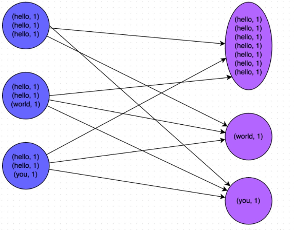

常见问题
===

Index
---

- [MapReduce中的数据倾斜](#MapReduce中的数据倾斜)
- [Reference](#Reference)

## MapReduce中的数据倾斜
- 表现
  - Hadoop 
    - 报错信息 
    reduce阶段**卡**在99%，一直不能结束 
    任务被**kill** 
    container报错**OOM**
  - Hive 
  发生在Sql中**Group和On**上
  - Spark 
  Spark streaming, **内存分配不够** 
  Spark sql 中**类似 join, group 的操作** 
    - 报错信息 
    Excutor lost, OOM, Shuffle过程出错 
    Driver **OOM**
    单个Excutor执行时间过长，整体任务**卡**在某个阶段不能结束 
    正常运行的任务**突然失败** 

- 原因 
数据分配不均匀，某一key的条数比其他key多很多，这条key所在的reduce节点所处理的数据量比其他节点大很多，从而导致某几个节点迟迟运行不完

- 解决方案
  - 参数调优 
  set hive.map.aggr=true;    注：在map中做部分聚合操作
  set hive.groupby.skewindata=true;       注：数据倾斜时负载均衡，生成两个MRJob,第一个将Map输出结果随机分配到Reduce中做聚合，第二个对预处理的数据按照group by key 分配到 Reduce中，完成最终的聚合操作
  - 

## Reference
- [什么是数据倾斜?如何解决数据倾斜?](http://www.raincent.com/content-10-10885-1.html)
- [MapReduce如何解决数据倾斜？](https://www.zhihu.com/question/27593027)
- [大数据常见问题之数据倾斜](https://blog.csdn.net/u010039929/article/details/55044407)
